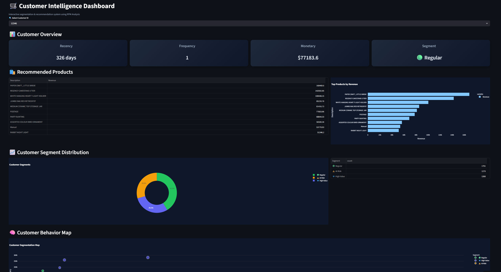
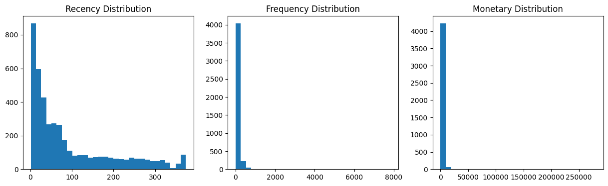
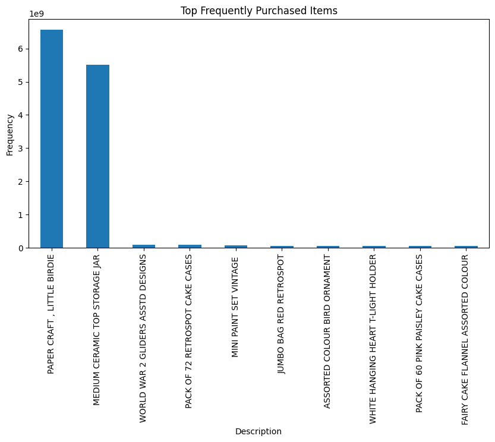
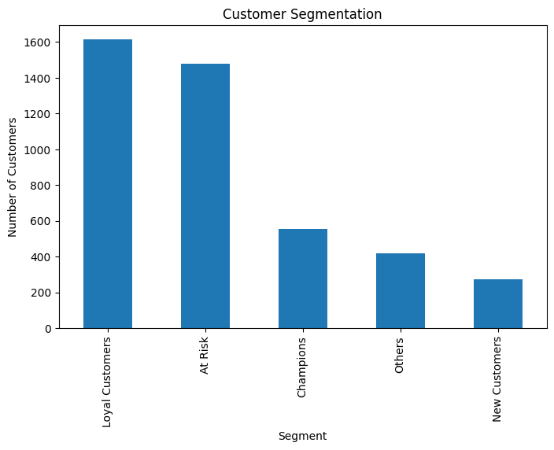
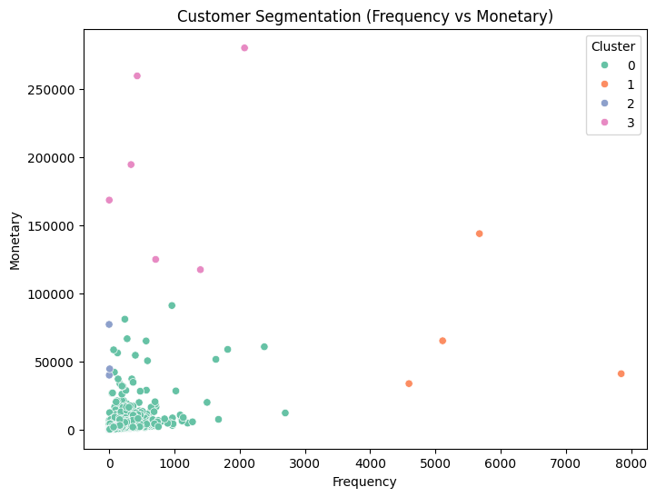

<div align="center">

# 🛒 Customer Intelligence & Recommendation System

### Data-Driven Customer Segmentation and Product Recommendation for Retail Analytics


### 🟢 Core Project (Data Science / Machine Learning) 2025

🔗 **Live Demo:** https://mwildannabila-customer-analytics.streamlit.app/

</div>

---

# 🖥️ Dashboard Preview



> Interactive customer analytics dashboard for segmentation, behavioral analysis, and recommendation-driven business insights.

---

# 🧠 Project Overview

This project develops an end-to-end customer analytics platform designed to transform retail transaction data into actionable business intelligence.

The system combines **RFM (Recency, Frequency, Monetary) segmentation**, customer behavior analysis, and product recommendation to support data-driven marketing strategies, customer retention initiatives, and revenue optimization.

The final solution is deployed as an interactive Streamlit dashboard with executive-level visualizations and filtering capabilities.

---

# 🎯 Project Objectives

- Segment customers using RFM analysis.
- Identify high-value, regular, and at-risk customers.
- Analyze purchasing behavior and revenue patterns.
- Generate product recommendation insights.
- Deploy an interactive customer intelligence dashboard.

---

# 🗂️ Dataset Overview

| Attribute | Value |
|---------|-------|
| Dataset Type | Retail Transaction Dataset |
| Domain | Customer Analytics |
| Key Variables | Customer ID, Invoice Date, Quantity, Unit Price |
| Analytical Features | Recency, Frequency, Monetary (RFM) |
| Output Segments | High Value, Regular, At Risk |

---

# 🧪 Methodology

```text
Data Cleaning & Preprocessing
        ↓
Feature Engineering
        ↓
RFM Calculation
        ↓
Customer Segmentation
        ↓
Behavioral Analysis
        ↓
Product Recommendation
        ↓
Executive Dashboard (Streamlit)
        ↓
Live Deployment
```

---

# ✨ Key Features

- 🧮 RFM-based customer segmentation
- 👥 Customer behavior mapping
- 🛍️ Product recommendation insights
- 📊 Segment distribution analysis
- 📈 Interactive executive dashboard
- 🔎 Real-time filtering and exploration

---

# 🖼️ Additional Insights

## 📈 Customer Overview


## 🛍️ Product Recommendation


## 📊 Segment Distribution


## 🧠 Customer Behavior Map


---

# 🔍 Key Insights

- Revenue is highly concentrated among a small group of high-value customers.
- A significant portion of customers are classified as At Risk, indicating potential churn.
- Purchasing frequency is uneven, highlighting engagement opportunities.
- Product performance analysis supports targeted recommendation strategies.

---

# 👨‍💻 My Role

This is a fully independent end-to-end project covering:

- Data cleaning and preprocessing
- RFM feature engineering
- Customer segmentation
- Behavioral analysis
- Product recommendation design
- Dashboard development and deployment
- Technical documentation

---

# 🚧 Key Challenge

**Challenge:** Transactional data exhibited highly skewed customer spending behavior, making segmentation thresholds sensitive to outliers.

**Solution:** I applied quantile-based RFM scoring to create robust and interpretable customer segments that better reflect real purchasing patterns.

---

# 💼 Business Impact

This platform enables businesses to:

- Identify and retain high-value customers.
- Detect customers at risk of churn.
- Improve targeted marketing campaigns.
- Optimize product strategies.
- Support customer lifetime value initiatives.

---

# 🛠️ Technology Stack

- Python
- Pandas
- NumPy
- Plotly
- Streamlit
- RFM Modeling
- Feature Engineering

---

# 🔮 Future Improvements

- Collaborative filtering recommendation engine
- Customer Lifetime Value (CLV) prediction
- Clustering comparison (RFM vs K-Means)
- Real-time analytics pipeline
- Advanced personalization

---

# 🎯 Career Relevance

Relevant for roles in:

- Data Analyst
- Data Scientist
- Business Intelligence Analyst
- Machine Learning Engineer
- CRM Analyst
- Customer Analytics Specialist

---

# 👨‍💻 Author

**Muhammad Wildan Nabila**  
Informatics — Universitas Muhammadiyah Malang

---

<div align="center">

### 🛒 Transforming Transaction Data into Strategic Customer Intelligence

</div>
